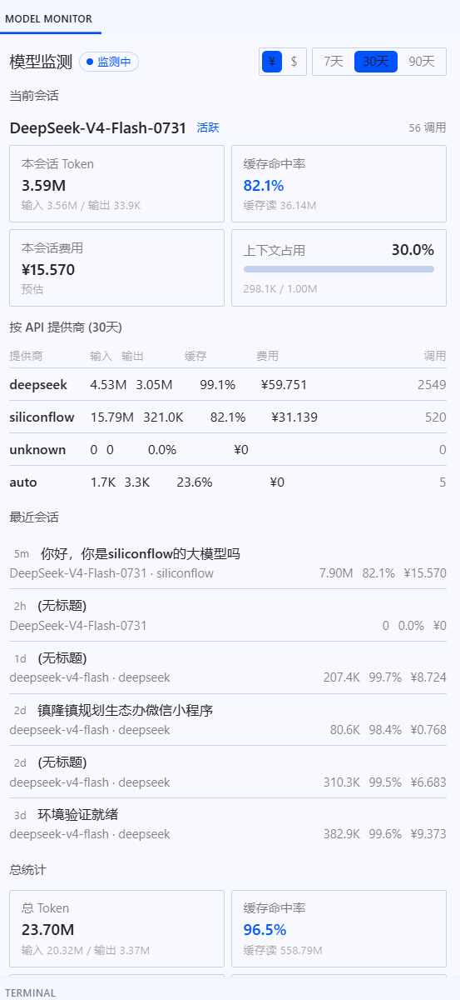

# AI Usage Monitor · AI 用量监测

**本地、只读的 AI 智能体用量与费用监测工具,自带 Hermes 桌面端插件。**

实时查看 **缓存命中率、Token 消耗、花费金额、各 API 提供商性能统计**——全程离线,数据不出本机:
服务读取各智能体的本地历史记录,输出 JSON 给界面插件。

   

[English](README.en.md) | **简体中文**

## 📸 界面预览



> 右侧「模型监测」面板:顶部实时显示当前会话,中部按 API 提供商统计,底部总统计。

## ✨ 功能特性

- **🎯 当前会话实时监测**(第一眼可见)
  - 正在使用的模型所消耗的 **Token**
  - **缓存命中率**(实时)
  - **本会话费用**
  - **上下文耗尽进度条**(≥85% 自动高亮提醒)
- **🪙 多货币显示** — 美元 / 人民币(¥)。自动跟随 Hermes 界面语言(简体中文 → ¥),面板内可手动 ¥/$ 切换
- **💰 费用按官网价重算** — 基于本地可编辑的价格表 `prices.json`(单位:美元/百万 Token),与厂商控制台一致(硅基流动价格已实测核对),不再依赖智能体内置估算
- **🏢 按 API 提供商统计** — deepseek / siliconflow / anthropic / openai 等:输入、输出、缓存命中率、费用、调用次数一目了然
- **💬 最近会话** — 显示**会话标题 + 相对时间**(now / 5m / 2h / 1d),一眼认出是哪次对话
- **🔘 插件内一键开关** — 在 Hermes 面板内直接开启/关闭监测,服务常驻待命、开关即时生效,**永不出现"关了就开不回来"**
- **🤖 多智能体支持** — Hermes Agent(开箱即用)+ Claude Code + Codex CLI(JSONL 解析适配器)
- **🛡️ 自愈保活** — watchdog 每 1 分钟探测,服务意外退出自动拉起(健康时完全静默)
- **🪟 零黑框** — 全部用 `pythonw` + `CREATE_NO_WINDOW` 无窗口运行;开机自启走启动文件夹快捷方式,**不需要管理员权限**

## 🏗️ 架构

```
┌─────────────────────┐        HTTP/JSON (CORS *)        ┌──────────────────────┐
│  stats_server.py    │ ◄──────────────────────────────► │  Hermes 桌面插件      │
│  (127.0.0.1:9543)   │          /api/stats              │  (右侧「模型监测」面板) │
│                     │          /api/live               └──────────────────────┘
│  ┌───────────────┐  │          /api/config
│  │ HermesAdapter │──┤  读取  ~/.hermes/state.db (SQLite)
│  │ ClaudeAdapter │──┤  读取  ~/.claude/projects/**/*.jsonl
│  │ CodexAdapter  │──┤  读取  ~/.codex/sessions/**/*.jsonl
│  └───────────────┘  │
└─────────────────────┘
        prices.json (价格表, 可编辑)
        config.json  (汇率 / 开关)
```

- **纯 Python 标准库**,零第三方依赖(`sqlite3` + `http.server`)
- **只读 & 本地**:仅绑定 `127.0.0.1`,数据库以只读模式打开,绝不写入任何数据
- 桌面插件运行于 Electron 的 `file://` 环境(origin 为 `null`),因此服务对所有响应返回 `Access-Control-Allow-Origin: *`。服务只监听回环地址且只输出只读聚合数据,本地工具场景下安全;若对外暴露请加认证代理

## 🚀 快速开始(Windows)

### 1. 启动数据服务

```bash
python stats_server.py --port 9543
# → AI Usage Monitor listening on http://127.0.0.1:9543
```

要求:Python 3.8+(无需任何第三方包)。Windows 用户可直接双击 `start-server.bat`(无窗口)。

### 2. 安装 Hermes 桌面插件

```bash
# <hermes home> 在 Windows 为 %LOCALAPPDATA%\hermes,Linux/macOS 为 ~/.hermes
mkdir -p "$HERMES_HOME/desktop-plugins/usage-monitor"
cp plugin/usage-monitor/plugin.js "$HERMES_HOME/desktop-plugins/usage-monitor/"
```

然后在 Hermes 桌面端:按 **⌘K → Reload desktop plugins(重新加载桌面插件)**。
右侧会出现「模型监测」面板,每 15 秒自动刷新。

> 插件请求 `http://127.0.0.1:9543`;服务未运行时面板会给出友好提示,服务恢复后 15 秒内自动恢复。

### 3. 开机自启(可选)

运行一次 `install-autostart.bat`,注册登录时静默启动(启动文件夹快捷方式,无管理员需求)。
取消自启:`Win+R` → 输入 `shell:startup` → 删除 `AIUsageMonitor.lnk`。

### 4. 检查 API

```bash
curl http://127.0.0.1:9543/health
curl "http://127.0.0.1:9543/api/stats?days=30"
curl "http://127.0.0.1:9543/api/live?limit=8"
curl http://127.0.0.1:9543/api/config
```

## 💵 价格与货币

费用在本地按 `prices.json` **重新计算**——单价单位为**美元 / 百万 Token**,按提供商分类、模型前缀最长匹配。示例(与硅基流动控制台 2026-08 一致):

```json
"siliconflow": {
  "deepseek-ai/DeepSeek-V4-Flash-0731": { "input": 0.14, "output": 0.28, "cache_read": 0.028 }
}
```

- 随时编辑 `prices.json`,重启服务生效
- 未匹配到价格的 (provider, model) 组合回退用智能体自身的估算(`estimated_cost_usd`)
- 货币:`config.json` 的 `usd_cny`(默认 7.2)为美元→人民币汇率;`currency_auto: true` 时插件跟随 Hermes 界面语言(中文 → ¥),面板内 ¥/$ 按钮可手动覆盖

## 🤖 支持的智能体

| 智能体 | 数据源 | 状态 |
|--------|--------|------|
| Hermes Agent | `~/.hermes/state.db`(sessions + session_model_usage) | ✅ 生产环境实测 |
| Claude Code | `~/.claude/projects/**/*.jsonl`(assistant 消息 `usage` 字段) | ✅ 解析器已内置 |
| Codex CLI | `~/.codex/sessions/**/*.jsonl`(递归扫描 `usage`) | ✅ 解析器已内置 |

Claude Code / Codex 的行会并入同一套总量、提供商统计(`anthropic` / `openai`)与最近会话列表。服务自动探测 Hermes home:`$HERMES_HOME` → `~/.hermes` → Windows 下 `%LOCALAPPDATA%\hermes`;也可用 `--home` 指定。

### 测试适配器

```bash
python tests/mock_adapters.py   # 构造模拟 JSONL 历史并断言解析结果
```

## 📡 API 参考

### `GET /api/stats?days=30`(1–365)

```json
{
  "ok": true, "days": 30, "generated_at": 1786700000,
  "totals": {
    "input_tokens": 9727630, "output_tokens": 3226386,
    "cache_read_tokens": 516047616, "cache_hit_pct": 98.1,
    "estimated_cost": 9.9024, "sessions": 26, "api_calls": 2860
  },
  "daily": [{ "day": "2026-08-14", "input_tokens": 1140085, "...": "" }],
  "by_model": [{ "model": "deepseek-v4-flash|deepseek", "estimated_cost": 8.29, "...": "" }],
  "by_provider": [{ "provider": "siliconflow", "cache_hit_pct": 85.0, "estimated_cost": 1.60, "...": "" }],
  "by_agent": [{ "agent": "hermes", "...": "" }]
}
```

### `GET /api/live?limit=8`

最近会话:`title`、`reltime`("now"、"5m"、"3h"、"2d"、"08-01")、`model`、`provider`、Token 数、`cache_hit_pct`、`estimated_cost`。

### `GET /api/config`

`{ prices, usd_cny, currency_auto, monitor_enabled }` — 界面据此渲染价格表、换算货币,并同步开关状态。

### `POST /api/control`

`{"enabled": true|false}` — 插件一键开关。关闭时数据接口返回 503(面板显示「已关闭」),进程保持存活,开关永远可达。

## 🔧 缓存命中率优化建议

- **保持会话连续**:前缀缓存按字节精确匹配,长会话命中率自然高(实测 deepseek 长会话 99%+)
- **避免中途切换模型/提供商**:切换会开新会话,缓存从零积累
- **降低上下文压缩频率**:Hermes 配置 `compression.threshold` 适当调高(如 0.75),减少压缩重建前缀

## 🤝 贡献

新增智能体适配器约 40 行:收集一行行数据
`{model, provider, input_tokens, output_tokens, cache_read_tokens, api_calls, started_at, title}`,
然后在 `collect_stats()` 中注册。欢迎 PR!

## 📄 许可

MIT — 随意使用,注明出处即可。
